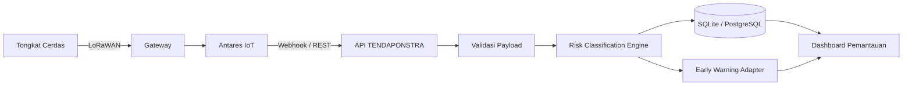

# TENDAPONSTRA

**Platform Sistem Pemantauan Mobilitas Berbasis Telemetri IoT LoRaWAN dan Real-Time Risk Classification untuk Manajemen Keselamatan Penyandang Disabilitas Netra**

TENDAPONSTRA menerima data telemetri dari tongkat cerdas, memvalidasi paket, mengklasifikasikan risiko, menyimpan riwayat, dan menyajikan status keselamatan melalui API serta dashboard pemantauan.

## Status proyek

Versi repositori: `1.0.0`

Repositori ini memuat implementasi referensi untuk lampiran Hak Cipta Program Komputer TENDAPONSTRA. Integrasi langsung dengan perangkat LoRaWAN, Antares IoT Platform, GPS, dan kanal notifikasi memerlukan kredensial serta konfigurasi lingkungan operasional.

## Fitur utama

- Validasi payload telemetri berdasarkan perangkat, waktu, jarak, baterai, kemiringan, dan tombol darurat.
- Klasifikasi status `SAFE`, `WARNING`, atau `DANGER` secara real-time.
- Logika prioritas untuk tombol darurat, halangan sangat dekat, dan kemiringan ekstrem.
- Penyimpanan SQLite untuk rekaman sensor dan kejadian risiko.
- REST API untuk telemetri, status terakhir, riwayat kejadian, dan konfigurasi ambang.
- Dashboard web untuk simulasi dan pemantauan kondisi perangkat.
- Unit test untuk skenario klasifikasi inti.

## Arsitektur



## Aturan klasifikasi default

| Prioritas | Kondisi | Status |
|---|---|---|
| 1 | Tombol darurat aktif | DANGER |
| 2 | Jarak halangan kurang dari 50 cm | DANGER |
| 3 | Kemiringan absolut minimal 60 derajat | DANGER |
| 4 | Jarak halangan 50 sampai 100 cm | WARNING |
| 5 | Baterai kurang dari 30 persen | WARNING |
| 6 | Tidak ada kondisi risiko | SAFE |

Nilai ambang dapat diubah melalui variabel lingkungan. Konfigurasi produksi harus divalidasi bersama pakar orientasi dan mobilitas, pengguna, pendamping, serta pengelola keselamatan.

## Struktur repositori

```text
TENDAPONSTRA/
├── backend/
│   ├── app/
│   │   ├── config.py
│   │   ├── database.py
│   │   ├── main.py
│   │   ├── models.py
│   │   └── risk_engine.py
│   └── tests/
│       ├── test_database.py
│       └── test_risk_engine.py
├── frontend/
│   ├── app.js
│   ├── index.html
│   └── styles.css
├── samples/
├── docs/
├── .github/workflows/ci.yml
├── Dockerfile
├── docker-compose.yml
└── requirements.txt
```

## Menjalankan aplikasi

### 1. Siapkan lingkungan Python

```bash
python -m venv .venv
```

Windows:

```bash
.venv\Scripts\activate
```

Linux atau macOS:

```bash
source .venv/bin/activate
```

### 2. Instal dependensi

```bash
pip install -r requirements.txt
```

### 3. Jalankan backend

```bash
uvicorn backend.app.main:app --reload
```

API tersedia pada `http://127.0.0.1:8000`. Dokumentasi interaktif tersedia pada `http://127.0.0.1:8000/docs`.

### 4. Jalankan dashboard

Buka terminal lain.

```bash
python -m http.server 5500 --directory frontend
```

Buka `http://127.0.0.1:5500`.

## Contoh pengiriman telemetri

```bash
curl -X POST http://127.0.0.1:8000/api/v1/telemetry \
  -H "Content-Type: application/json" \
  -d @samples/telemetry-danger.json
```

Contoh respons:

```json
{
  "device_id": "TDP-001",
  "risk_status": "DANGER",
  "reasons": ["Halangan sangat dekat: 40.0 cm"],
  "priority": 2
}
```

## Pengujian

```bash
python -m unittest discover -s backend/tests -v
```

## Catatan keselamatan

TENDAPONSTRA merupakan sistem pendukung pemantauan. Program tidak menggantikan pelatihan orientasi dan mobilitas, prosedur tanggap darurat, penilaian profesional, atau pendampingan manusia. Pengujian lapangan wajib dilakukan secara terkendali sebelum penerapan operasional.

## Pencipta

- Shabrina Salsabila
- Enjilika Desi Nadear Simarmata
- Miftahol Arifin
- Yulinda Uswatun Kasanah
- Nabila Noor Qisthani
- Ratih Windu Arini

Pemegang Hak Cipta: Telkom University Purwokerto.

## Hak penggunaan

Hak cipta dilindungi. Lihat [LICENSE](LICENSE). Publikasi kode pada GitHub tidak otomatis memberikan izin untuk menyalin, memodifikasi, mendistribusikan, atau menggunakan program untuk tujuan komersial.

